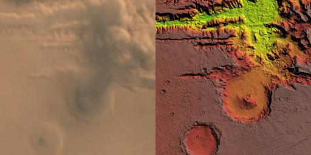
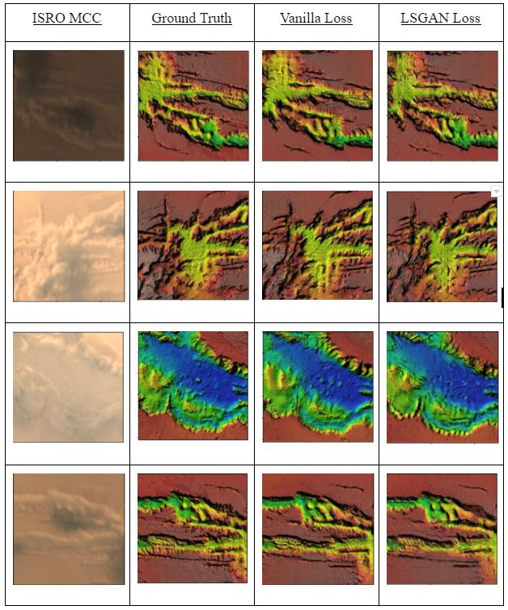
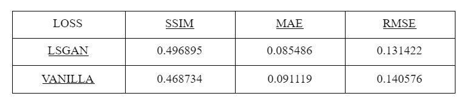
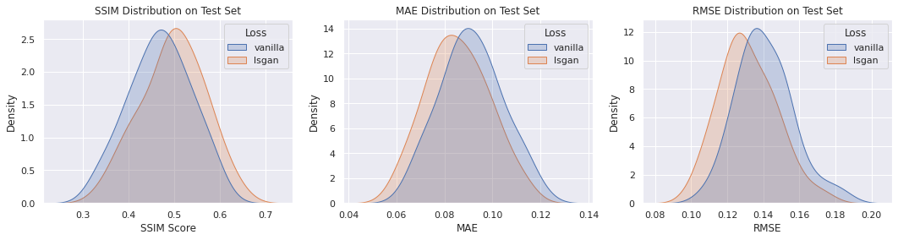

# Depth-Estimation-Of-Martian-Surface-from-ISRO-Satellite-Images
Using Pix2Pix model for image to image translation from Domain A (ISRO satellite image of Martian Surface) to Domain B (Corresponding Depth Image)<br>

<br>
<b>Abstract</b>
</br>
Currently, the Indian Space Research Organization (ISRO) is carrying out various research projects regarding the planet Mars. Earlier, it deployed Mars orbiter in the year 2013 for collecting information which can be further used for conducting even more in-depth research about the planet’s topography, temperature, atmosphere, etc. 

One such research area that ISRO is currently focusing on is estimating the depths of various valleys, canyon systems of the Martian planet. As per the current scenario, one such method for estimating depths is using Lidar technology. 

We proposed a method where we use Generative Adversarial Networks to estimate such Depth Maps, which can be further used for creating 3D models or simulations of the surface for researching and further planning of future missions.   
</br>

<br>
<b>Data Collection</b>
</br>
For this project currently there exists no specific dataset, which consists of both the satellite images and the depth maps, hence we created our own dataset for this project. 
<br>
The dataset we created consists of two type of images -<br>
&emsp;1. Satellite images which were taken from ISRO’s Mars Orbiter in different lighting conditions.<br>
&emsp;2. Depth image obtained from NASA’s MOLA map.<br>

<br>
<b>Data Preprocessing</b>
</br>
1. We gathered 1:1 identical pair of images from Isro satellite images and Nasa's Mola Depth Map respectively, along Valles Marineris canyon system at the map scale of 53km .<br>
2. A total of 38 images were collected which were captured by MOM at different intervals of time in its orbits. <br>
3. Each image was augmented to a set of 10 images thus reaching a total count of 380 images.<br>
4. Different augmentation techniques were used such as :<br>
&emsp;Resize<br>
&emsp;Rotate<br>
&emsp;Shift Scale<br>
&emsp;Center Crop<br>
&emsp;Horizontal flip<br>
&emsp;Vertical flip<br>
&emsp;Blur<br>
&emsp;Brightness<br>
&emsp;Contrasts<br>
&emsp;Hue Saturation<br> 
5. These images were randomly partitioned into training (343) & testing (37) .<br>
<br>


### Sample Pair Image<br>


### Model Used:
We have used [<b>Pix2Pix</b>](https://github.com/junyanz/pytorch-CycleGAN-and-pix2pix) model to solve this Task.<br>
We have tested this model with two loss functions:
&emsp;1.Vanilla Gan Loss
&emsp;2.Lsgan Loss
<br>
## Results<br>
### Output:
<br>
### Loss Function vs Performance Metrics:
<br>

### Performance Metric Distribution:
<br>

```
@inproceedings{isola2017image,
  title={Image-to-Image Translation with Conditional Adversarial Networks},
  author={Isola, Phillip and Zhu, Jun-Yan and Zhou, Tinghui and Efros, Alexei A},
  booktitle={Computer Vision and Pattern Recognition (CVPR), 2017 IEEE Conference on},
  year={2017}
}
```
